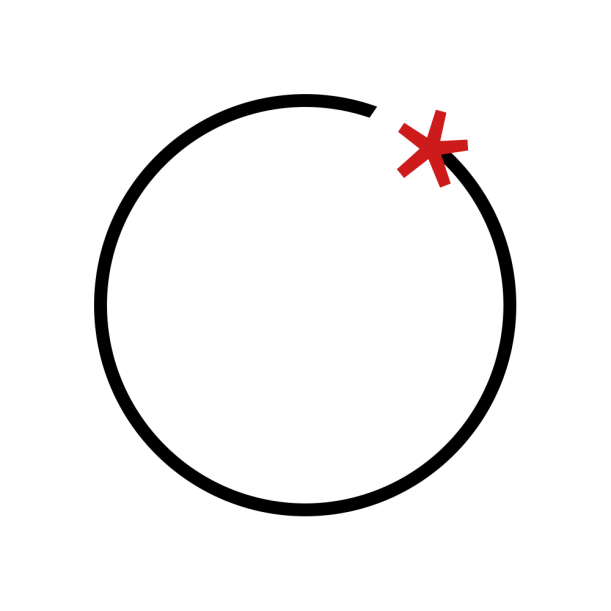

<h1 align="center"> Penthon </h1>  

	<a>
		  
		
		 
         
		Useful Python functions for pentesting, networking, data conversion and automation
         
	</a>

## What is this project?
This project is meant to collect pieces of Python code that one can find useful.  
This chunks of code include things like:  

- Port forwarding -> `port_forward()`
- Kill process by PID ->`kill_pid()`
- Get interfaces -> `get_interfaces_full()`
- Load external Python modules from the given subdir -> `load_modules_from_subdir()`
- Probe proxy presence through TRACE method -> `TRACE())`

## Contribute
Contributions are always welcome!

## License
 
